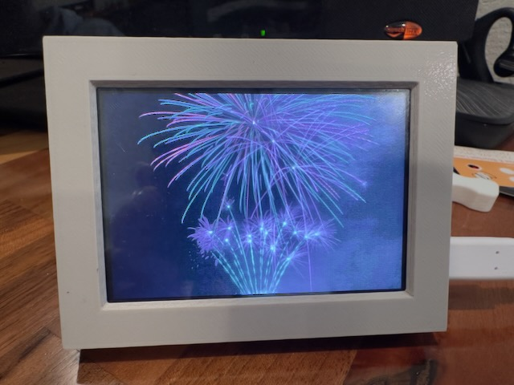

# PyPortal Titano Picture Frame

Use a [PyPortal Titano](https://www.adafruit.com/product/4444) as a little picture frame with images pulled from your favorites in [Immich](https://immich.app/).

The project is structured into three main parts:

* `client`: the CircuitPython code that runs on the PyPortal Titano
* `server`: A Python Flask HTTP server that connects to your Immich instance and does image conversions and other middleware between Immich and the picture frame
* `hardware`: The OpenSCAD files for the 3D printed parts

## Setup

### Things you'll need

For hardware, you'll need this stuff. Yay, no soldering or wiring at all!

* An [Adafruit PyPortal Titano](https://www.adafruit.com/product/4444)
* A microSD card
* A 3D printer
* A USB C-to-C cable
* A USB C power supply
* 8× M3x4 screws
* A computer with a USB C port and a microSD card reader, or an SD card reader with a microSD-to-SD adapter (many cards come with this)

You might want a USB C cable with a right angle connector, but it's not necessary.

You also need:

* [Immich](https://immich.app/) up and running somewhere
* A computer that runs 24/7 to run a Python server
* A very basic understanding of how to run Python scripts and install packages

Each picture takes up about 500 KB of space on the card. A 1 GB card therefore can hold about 2000 pictures, and a 16 GB card holds around 30,000. microSD cards are pretty cheap so I'd suggest getting a reasonably big one, or a good sized one you already have laying around. The card isn't written to very often, so I wouldn't bother with "endurance" cards or other expensive ones. Besides, if the SD card dies, just put in a new one and the picture frame will sync everything automatically again.

### Building everything

First, set up the software environment for your server. The server acts as a bridge between the picture frame and Immich to download images and convert them to a format compatible with the PyPortal Titano. The PyPortal Titano doesn't talk directly to Immich.

1. Clone this Git repository, or download a `.zip` of it and extract it.
2. `cd` to the `server` directory. All the subsequent commands you'll run should be within the `server` directory.
3. Copy `.env.example` to `.env`, then modify `.env` as documented within that file.
4. Create a virtual environment: `cd` to the `server` directory, create an environment with `python3 -m venv ./.venv`, and activate it with `source .venv/bin/activate`.
5. Install the necessary Python libraries with `pip3 install -r requirements.txt`
6. Launch the server with `python3 server.py`. Note the IP address and port number of your server; you'll need that next.

Before moving on, open your Immich instance and favorite some pictures (not videos). The server will pick from your favorites when listing the available pictures for the picture frame.

With the server done, you can move into the rest of the assembly.

1. [Install CircuitPython 10 on the board](https://learn.adafruit.com/adafruit-pyportal-titano/circuitpython#set-up-circuitpython-quick-start-3050161).
2. Print the enclosure:
    * Use 0.2mm layer height.
    * Use any filament you want. PLA is easiest.
    * Do not use supports.
    * Orient the parts such that the case is upside down, the backplate prints with the flat part facing down, and the stand as-is.
3. Format the microSD card in your computer as FAT32 for cards up to and including 32 GB, or exFAT for cards larger than 32 GB (instructions for [macOS](https://support-en.sandisk.com/app/answers/detailweb/a_id/35101/~/steps-to-format-a-memory-card-on-macos), [Windows](https://support-en.sandisk.com/app/answers/detailweb/a_id/9063/~/instructions-to-format-a-memory-card-on-windows)). This will delete all the data on the card!
3. Assemble the enclosure:
    1. If installed, peel off the protective plastic cover on the PyPortal Titano's screen.
    2. Insert the microSD card into the board until it clicks into place.
    3. Place the board into the enclosure with the screen facing the opening and the USB C port and microSD card slot facing their respective locations.
    4. Use 4× screws to secure the board into the enclosure's standoffs. Do not tighten the screws any further than necessary to keep the board in place.
    5. Screw the backplate into place with the other 4× screws. Orient the backplate so the hole labeled "reset" aligns with the reset button on the board. Again, only tighten the screws as much as necessary.
    6. Install the stand by pressing one side of it into the mounting point on the backplate, then gently squeezing the stand into place and pressing the other side into its mounting point.
    7. If you want to use the ambient light sensor, shove a little piece of 1.75mm transparent filament (any material) into the hole near the microSD card until it's flush with the outside of the case. If you don't care about having the screen adjust its brightness automatically, or you odn't have any transparent filament, you can skip this.
4. Install the software for the picture frame:
    1. Clone this Git repository, or download it as a `.zip` and extract it.
    2. Copy `client/settings.toml.example` to `client/settings.toml` and open it in a text editor.
    3. At a minimum, look at the section "Settings you'll have to change" and change those values. There are more settings you can change if you want, but it's not necessary.
    4. Copy everything in the `client` directory, but not the `client` directory itself, to the `CIRCUITPY` drive. It might take a while. Eventually the board should reboot, connect to Wi-Fi, and start showing your pictures!

## Usage

It's very easy: favorite a picture in your Immich instance, and eventually it'll appear in the rotation of pictures on the picture frame. Unfavorite a picture to remove it from the rotation. If you replace an image with another upload, the replacement will be detected too.

The picture frame syncs itself every hour by default. Only static images will show up, so favorited videos, motion pictures, and other types of assets will be ignored.

The picture frame can work offline, but it's not really meant to. If there's a Wi-Fi connection error, either at startup or when syncing, an icon appears on the screen and the sync is skipped. The next one will attempt to reconnect and the process repeats. In the meantime, assets directly on the SD card are shown in the slideshow.

When powering up the picture frame with assets already on the SD card, the slide show starts immediately and then the sync runs, so you can start the picture frame with at least some picture showing up. If there are no assets on the SD card, like when you first power on the picture frame, a sync is forced and if it fails, a message stating that there are no pictures is shown until the next sync attempt.

## Background info

The overall workflow of the picture frame is:

1. PyPortal starts up, mounts its SD card to `/sd`, initializes its external ESP32 for Wi-Fi, and connects.
2. At startup, and then every hour by default, it:
    1. Connects to the Flask server and does a `GET` for `/assets`. This endpoint returns a JSON map of favorited applicable asset UUIDs in Immich to MD5 hashes of their checksums. In Immich, this is the `/api/search/metadata` endpoint, which also supports pagination.
    2. A list of all assets on the SD card are indexed. If a UUID is found on the SD card that isn't in the JSON map from the server, or if the UUID does exist but the hash differs, that asset on the SD card is deleted.
    3. A list of assets to download is assembled: this is every UUID in the JSON map that's not on the SD card or ones with differing MD5 hashes.
    4. Each asset (if any) is downloaded as a `.bmp` from the `/asset/<uuid>` endpoint in the Flask server. Before each individual download, disk space is freed if necessary. More specifically, the asset is downloaded by the Flask server's `/asset/<uuid>` endpoint which in turn gets it from Immich's `/api/assets/<uuid>/thumbnail` endpoint, resized to 480x320 with letterboxing/pillarboxing added as necessary to ensure the image is exactly that size, then streamed back as an uncompressed paletted `image/bmp`.

Assets are stored in `/sd/assets/<uuid>/<md5>.bmp`. Bitmaps are used instead of JPEGs because `displayio.OnDiskBitmap` is needed to directly stream the bitmap data from the SD card to the screen. The JPEGs are too big to decode and buffer into the tiny amount of memory available. This is also one of the key reasons the Flask server exists: the images in Immich are way, way too big to manipulate directly on the board, but trivial for Python's Pillow library to do so on a real server.

There is no persistent index of images on the card. Instead, the filesystem is iterated to find candidate files and a random one picked. This, presumably, will be slow if there are a lot of images. The code won't randomly show the same image twice in a row unless there's only one image available.

The MD5 hash is used to detect checksum changes. This happens if a user replaces an image in-place in Immich and therefore the one stored on the SD card should be updated too.

So why not a Raspberry Pi? Yes, there are other options out there, and more powerful ones. Why did I make this instead?

* For better or worse, I don't need to expose my Immich instance.
* The PyPortal Titano is overall a great board for this application: it's little, it's got a built-in screen, and (mostly) easy to work with.
* I don't need to run and maintain a full-blown Linux computer like a Raspberry Pi.
* I can just unplug it and not worry about corrupting a filesystem. Even if the SD card gets corrupted, no code is stored there so it doesn't matter.
* If I want to change from Immich to something else, the client code isn't really tied to Immich and just the server needs updates. The client doesn't actually know it's talking to Immich.
* I just wanted to make it.

If you want a much more capable and productive option, I believe there are other projects out there that let you do slideshows of your Immich library on a Raspberry Pi or other spare computer.

## Troubleshooting

Before doing anything, [connect to the board's serial console](https://learn.adafruit.com/welcome-to-circuitpython/the-repl) and watch the output. Errors are likely to show up here and be more informative than what the board shows on its screen.

* **It's super slow to download my pictures.** If you have a bunch of favorited pictures in Immich it might take a _long_ time to download everything the first time. Each favorited picture gets downloaded as an uncompressed bitmap because that's all that's supported by the board and its limited memory, and the board's Wi-Fi is already pretty slow. Subsequent syncs should be much faster as the board will only download new or updated files and delete old ones instead of downloading everything each time.
* **No pictures are available.** Make sure you favorited at least one picture. The server will only consider assets in Immich that:
  * Are favorited
  * Are _not_ motion pictures
  * Are _not_ offline
  * Have a type of "image", so not videos or other types
* **I favorited some pictures but they aren't showing up in the slideshow.** The picture frame checks for favorited pictures at startup, and then periodically by default every hour. You can adjust this timing by changing `SYNC_INTERVAL_SECONDS` in `settings.toml`.
* **The picture frame is working, but it takes a few seconds for a picture to _slowly_ draw itself into the screen.** Such are the limitations of the board. It's by design a very slow CPU and, more importantly, has very little memory. This means it has to read a bitmap image, which is relatively large, directly off the SD card instead of first buffering it into memory. You can try to use a faster SD card, but the board is only so fast itself.
* **I'm using Cloudflare and having problems.** You may need to disable bot protections for Immich and/or your Flask server, depending on which is exposed to the internet and how things are connected together. Cloudflare may be thinking, and correctly so, that bots are attempting to access your Immich instance or the Flask server because the code sends a default user-agent for CircuitPython. Note that for the picture frame to work, the Flask server has to be directly accessible from the picture frame, but the picture frame doesn't access Immich directly so that can be more protected.
* **The picture frame keeps randomly rebooting itself.** If plugged into your computer, the board might think it's being written to, and CircuitPython automatically reboots when that happens to load code changes. When using the picture frame as just...a picture frame, plug it into a USB C power supply instead of a computer.
* **The stand is flimsy and it keeps falling over.** The tolerances for the stand are pretty tight, and fiddling with the stand a bunch will eventually loosen it too. Print another stand, and that's not an improvement, a new backplate. If that doesn't help, tweak the tolerances in the OpenSCAD file to suit your needs. The default values work well me for me with PLA printed on a Prusa MK3s+ with the 0.20mm quality profile.
